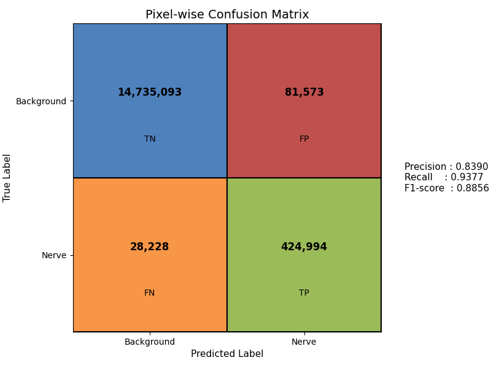

# 🧠 AG-USegNet: Attention-Guided Ultrasound Nerve Segmentation using Hybrid U-Net + SegNet

## Introduction
Ultrasound imaging is widely used in medical diagnostics, but segmenting anatomical structures like nerves remains a challenging task due to low contrast, speckle noise, and anatomical variations. This project implements an **attention-guided hybrid deep learning model combining U-Net and SegNet** for **Brachial Plexus segmentation** from ultrasound images.

The model integrates **attention mechanisms** to enhance nerve-specific features while suppressing background noise, improving segmentation accuracy and efficiency.

---

## Importance & Relevance
Accurate segmentation of the **Brachial Plexus nerve** is crucial for various medical applications:

- **Regional Anesthesia**: Helps doctors accurately locate nerves for safer procedures  
- **Surgical Planning**: Reduces risk of accidental nerve damage  
- **Medical Training**: Enables high-quality labeled data for training and automation  

---

## Challenges in Brachial Plexus Segmentation
- The **Brachial Plexus is small** and blends with surrounding tissues  
- **Ultrasound images are noisy** with low contrast  
- **Traditional CNNs struggle** with fine details and global context  
- Poor balance between **localization and feature extraction**  

---

## Why Hybrid U-Net + SegNet?
This project combines the strengths of both architectures:

- **U-Net**: Captures fine details using skip connections  
- **SegNet**: Ensures efficient and precise pixel-wise segmentation  
- **Hybrid Approach**: Improves boundary detection and localization  
- **Attention Integration**: Enhances relevant features while suppressing noise  

---

## 🏗️ Model Architecture
The **AG-USegNet** consists of:

1. **Encoder (U-Net)**  
   - Extracts multi-scale features  
   - Preserves spatial information using skip connections  

2. **Bottleneck**  
   - Learns deep semantic representations  

3. **Decoder (SegNet-inspired)**  
   - Uses pooling indices for efficient upsampling  
   - Produces sharp segmentation masks  

4. **Attention Gates**  
   - Focus on nerve-relevant regions  
   - Suppress irrelevant background features  

---

## 🧠 Attention Mechanism
- Integrated **attention-gated skip connections**  
- Highlights **important nerve regions**  
- Reduces background noise interference  
- Improves **boundary detection and localization accuracy**  

---

## Dataset
- Source: **Kaggle Brachial Plexus Ultrasound Dataset**

### Dataset Structure:
- **Images**: Ultrasound scans  
- **Masks**: Binary segmentation masks  
- **CSV File**: Pixel-level annotations  

---

## Methodology

### Data Preprocessing:
- Normalization  
- CLAHE (contrast enhancement)  
- Data augmentation (rotation, flipping, scaling)  

### Model Training:
- Loss Function: **Binary Cross-Entropy + Dice Loss**  
- Optimizer: **Adam**  
- Early stopping to prevent overfitting  
- Attention-guided feature refinement  

### Evaluation Metrics:
- Dice Coefficient  
- Intersection over Union (IoU)  
- Precision & Recall  
- F1-Score  
- Boundary Accuracy  

---

## 📊 Results
- **Dice Coefficient:** 0.8450  
- **F1-Score:** 0.8856  
- **IoU:** 0.7947  

✅ Improved segmentation accuracy compared to baseline models  
✅ Better boundary detection and localization  

---

## 🔬 Ablation Study
- Compared model performance:
  ### 📊 Performance Visualization

📌 Result:  
Attention significantly improves segmentation quality and precision  

## 🚀 Key Highlights
- Attention-guided hybrid architecture (U-Net + SegNet)  
- Improved performance in noisy ultrasound images  
- Lightweight and efficient for near real-time inference  

## 🔮 Future Work
- Real-time deployment optimization  
- Multi-class medical image segmentation  
- Advanced post-processing (CRFs)  

## Conclusion
This project demonstrates the effectiveness of an **attention-guided hybrid U-Net + SegNet architecture** for brachial plexus nerve segmentation. The model improves segmentation accuracy and can assist medical professionals in diagnosis and treatment planning.

